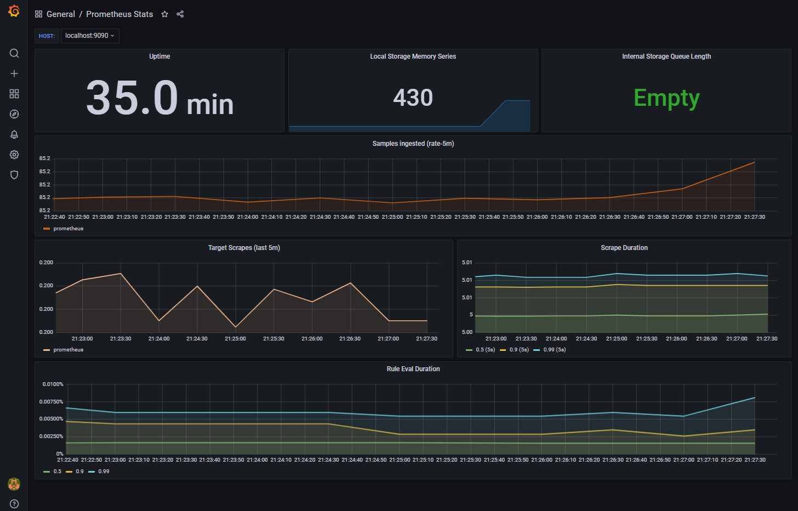
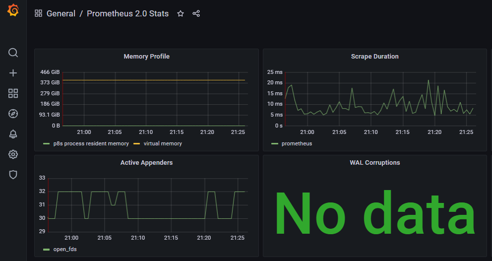
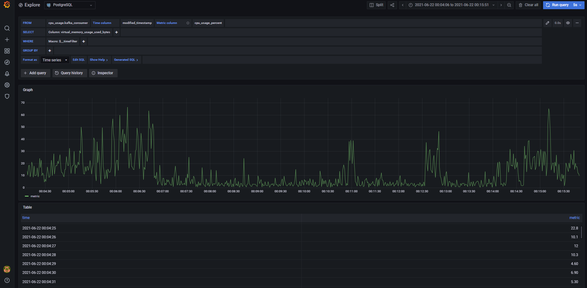
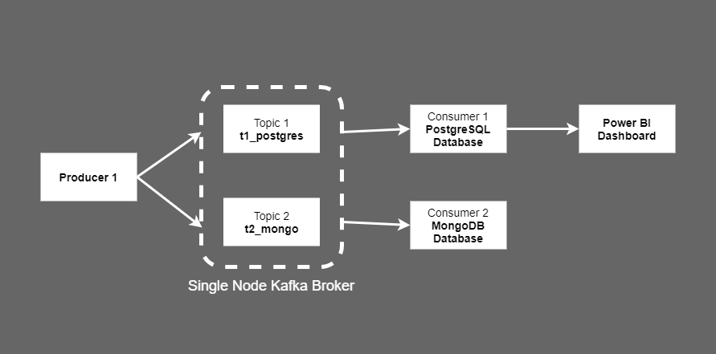

# Real-time Monitoring with Kafka, Prometheus & Grafana

Real-time IT infrastructure monitoring with **Kafka** streaming, **Prometheus** monitoring system and **Grafana** 
interactive visualisation.

## Description

Built a solution to take infrastructure time series properties, such as CPU load as an input. Streamed metrics from a 
Kafka producer to two Kafka consumers (i.e. MongoDB Database and PostgreSQL Database), and presented in 
Grafana interactive visualisation web application.

### Prerequisites

* WSL (Windows Subsystem for Linux) version 0.2.1 (for Windows 10 OS users)
* Java JDK version 12.0.2
* Gradle version 6.8.3
* Zookeeper version 3.7.0
* Kafka 2.7.0
* Prometheus 1.2.1
* Prometheus JMX Exporter 0.6 and Kafka YML 0-8-2
* Grafana 8.0.3
* PostgreSQL version 11
* pgAdmin version 4.21
* MongoDB version 4.2
* MongoDB Compass Community version 1.21.2

### Configure

* Zookeeper system variable path
* Zookeeper `zoo.cfg` file, update `dataDir` path (i.e. directory where snapshot is stored)
* Kafka system variable path
* Kafka `server.properties` file, update `log.dirs` path (i.e. directory where log files are stored)
* Kafka `zookeeper.properties` file, update `dataDir` path (i.e. directory where snapshot is stored)
* Prometheus: Download `wget https://github.com/prometheus/prometheus/releases/download/v1.2.1/prometheus-1.2.1.linux-amd64.tar.gz`
* Prometheus: Navigate to prometheus download location and extract Tar `tar -xzf prometheus-*.tar.gz`
* Prometheus: Navigate to Kafka directory and download jmx_prometheus_javaagent-0.6 `wget https://repo1.maven.org/maven2/io/prometheus/jmx/jmx_prometheus_javaagent/0.6/jmx_prometheus_javaagent-0.6.jar`
* Prometheus: Navigate to Kafka directory and download download kafka-0-8-2.yml: `wget https://raw.githubusercontent.com/prometheus/jmx_exporter/master/example_configs/kafka-0-8-2.yml`
* Prometheus / Kafka: Set environment variable `export KAFKA_OPTS='-javaagent:/mnt/c/tools/kafka/kafka-2.7.0-src/jmx_prometheus_javaagent-0.6.jar=7071:/mnt/c/tools/kafka/kafka-2.7.0-src/kafka-0-8-2.yml'`
* Grafana: Download `wget https://dl.grafana.com/oss/release/grafana-8.0.3.linux-amd64.tar.gz`
* Grafana: Navigate to grafana download location and extract Tar `tar zxf grafana-8.0.3.linux-amd64.tar.gz`

### Implementation High-Level Architecture

### Instructions

1. Open pgAdmin
    * Navigate to SQL scripts in `<PATH>/real-time-infrastructure-monitoring/src/` folder
    * Run `create_postgres_database.sql` SQL script to create Postgres `infrastructure` database
    * Run `create_postgres_schema.sql` SQL script to create Postgres `cpu_usage` schema
    * Run `create_postgres_table.sql` SQL script to create Postgres `kafka_consumer` table

2. Open new Ubuntu or Bash terminal to start Zookeeper server
    * Navigate to Kafka installation folder `<PATH>/kafka-2.7.0-src/`
    * Run `bin/zookeeper-server-start.sh config/zookeeper.properties` command
    
3. Open new Ubuntu or Bash terminal to start Kafka server
    * Navigate to Kafka installation folder `<PATH>/kafka-2.7.0-src/`
    * Run `bin/kafka-server-start.sh config/server.properties` command
    * Visit url on web browser to check Kafka metrics `http://localhost:7071/metrics`

4. Open new Ubuntu or Bash terminal to run Prometheus
    * Navigate to Prometheus installation folder `<PATH>/prometheus/prometheus-1.2.1.linux-amd64/`
    * Execute `./prometheus` command to start Prometheus
    * Visit url on web browser `localhost:9090` or `localhost:9090/graph`
    Extra Info
    * `prometheus` file. It's a binary file which is the core daemon.
    * `prometheus.yml` file. This is the config file for Prometheus service.
    * `promtool` file. This is another binary file which is used to compile the alert rules file. This will be explained in detail in the next series to this tutorial.

5. Open new Ubuntu or Bash terminal to start Grafana and view Dashboard
    * Navigate to Grafana installation folder `<PATH>/grafana/grafana-8.0.3/`
    * Execute `./bin/grafana-server web` command to start Grafana
    * Visit url on web browser `http://localhost:3000/` to view dashboard.
    * Log-in for the first time using the default admin credentials (i.e. user: admin; password: admin). You will be prompted to change password on first login.

6. Open new Ubuntu or Bash terminal to run Python-Kafka PostgreSQL consumer script
    * Navigate to Kafka Consumer 1 (Postgres) Python script `<PATH>/real-time-infrastructure-monitoring/src/kafka_consumer_postgres.py`
    * Run `python <PATH>/real-time-infrastructure-monitoring/src/kafka_consumer_postgres.py` python script
    
7. Open new Ubuntu or Bash terminal to run Python-Kafka MongoDB consumer script
    * Navigate to Kafka Consumer 2 (Mongo) Python script `<PATH>/real-time-infrastructure-monitoring/src/kafka_consumer_mongo.py`
    * Run `python <PATH>/real-time-infrastructure-monitoring/src/kafka_consumer_mongo.py` python script

8. Open new Ubuntu or Bash terminal to run Python-Kafka producer script
    * Navigate to Kafka Producer Python script `<PATH>/real-time-infrastructure-monitoring/src/kafka_producer.py`
    * Run `python <PATH>/real-time-infrastructure-monitoring/src/kafka_producer.py` python script

### Infrastructure Time Series Properties

* CPU Usage Percent
* Virtual Memory Usage Percent
* Virtual Memory Usage Available Bytes
* Virtual Memory Usage Used Bytes
* Swap Memory Usage Percent
* Swap Memory Usage Free Bytes
* Swap Memory Usage Used Bytes
* Modified Timestamp
* Computer User

